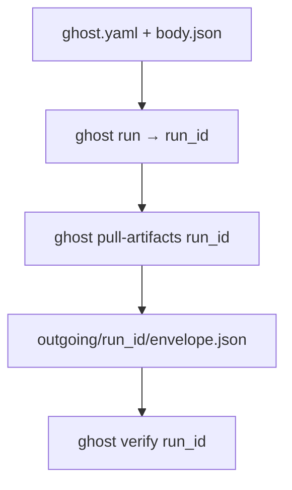

# Ghost CLI — Quickstart (Kanonik)

Eine Seite: **Ordner-Wahrheit** und **Mindest-Commands**. Vollständige Flags und Unterbefehle: [`ghost_cli_reference.md`](ghost_cli_reference.md).

---

## Kanonik (Option A)

| Was | Wo |
|-----|-----|
| Arbeitsverzeichnis | Beliebig (z. B. Ordner nach `ghost init-demo [ZIELPFAD]`). |
| Konfiguration | `ghost.yaml` im Arbeitsverzeichnis (oder äquivalente Umgebungsvariablen). |
| Payload | Datei(en) wie `input.json` (von `init-demo` erzeugt) oder Pfade, die du an `ghost run` übergibst. |
| Artefakte lokal | Nach `ghost pull-artifacts <run_id>` unter **`outgoing/<run_id>/`** (Root konfigurierbar: `outgoing_root` / `ARCTIS_GHOST_OUTGOING_ROOT`). |
| Optionales lokales `output/` | Nur wenn euer Prozess das so vorsieht — nicht mit dem Repo-`output/` verwechseln (siehe unten). |

### Repo-Root `input/` und `output/` (Abgrenzung)

Im **Repository** liegen [`../input/README.md`](../input/README.md) und [`../output/README.md`](../output/README.md): nummerierte Test-Tasks und Golden Files für den Harness. Das ist **kein** Ersatz für euer Ghost-Arbeitsverzeichnis und kein vorgegebener Kunden-„Workspace“.

### Begriff `incoming/`

In älteren Plan- und Marketing-Dokumenten kann **`incoming/`** als Zukunfts-Hot-Folder vorkommen. Die **aktuelle CLI** arbeitet mit Payload-Dateien und **`outgoing/…`** nach `pull-artifacts`, nicht mit einem festen `incoming/`-Baum im Repo.

---

## Mindest-Commands

```bash
python -m pip install --upgrade pip
pip install -e ".[dev]"
ghost init-demo
ghost doctor
ghost run input.json
ghost watch <run_id>
ghost pull-artifacts <run_id>
ghost verify <run_id>
```

- **API-Key:** bevorzugt `ARCTIS_API_KEY` setzen, nicht in YAML im Klartext versionieren.
- **`workflow_id`:** in `ghost.yaml` oder per Tenant-Setup ersetzen (siehe CLI-Referenz).

---

## Customer-Execute: von Null bis verify

**Kern-Story:** eine JSON-Datei mit dem Execute-Body → **`ghost run`** → **`pull-artifacts`** → **`verify`**. Beispielinhalt: [`examples/customer_execute_body.json`](examples/customer_execute_body.json) (entspricht dem `input.json` aus `init-demo`).

### Nummeriert (End-to-End)

1. Arbeitsverzeichnis mit `ghost.yaml` + Execute-JSON (z. B. `body.json` oder [`customer_execute_body.json`](examples/customer_execute_body.json)).
2. `ghost run body.json` → **Run-ID** (eine Zeile stdout).
3. `ghost pull-artifacts <run_id>` → schreibt u. a. `outgoing/<run_id>/envelope.json`.
4. `ghost verify <run_id>` → Abgleich lokales Envelope ↔ `GET /runs/{id}`.

Dazwischen optional: `ghost watch`, `ghost explain`, `ghost evidence` — siehe [`demo_60.md`](demo_60.md).

### Ablauf (Überblick)



Vollständige Sicherheits- und Pfadregeln: [`ghost_cli_reference.md`](ghost_cli_reference.md).

---

## Weiterlesen

- 60-Sekunden-Demo: [`arctis_ghost_demo_60.md`](arctis_ghost_demo_60.md)
- Launch-Plan (Phasen A0–A4): [`agent_prompt_plan_launch_a0_a4.md`](agent_prompt_plan_launch_a0_a4.md)
